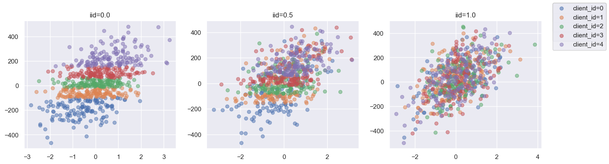
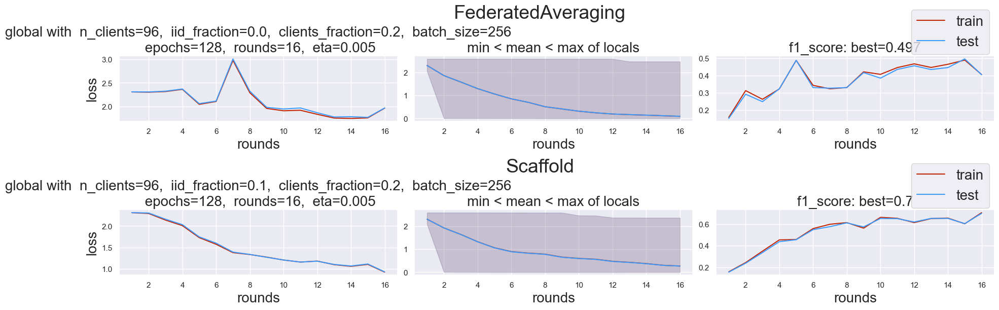

# FeLeRe

Federated learning library for researchers.

## About

This library provides an easy-to-use  API and infrastructure for performing analysis and research in the field of federated learning. 

It relies on the simulation of client-server communications, which takes into account client latency and heterogeneous data distributions across all clients.

## Contents

1. [About](#about)
2. [Contents](#contents)
3. [More About FeLeRe](#more-about-felere)
    1. [Components](#components)
    2. [Unique feature](#unique-feature)
    3. [Implemented methods](#implemented-methods)
4. [Usage](#usage)
    1. [Methods comparison](#methods-comparison)
    2. [Methods implementation](#method-implementation)
5. [Example of the learning process](#example-of-the-learning-process)
6. [References](#references)

## More About FeLeRe

Usually, FeLeRe can be used in either of the following ways:

* Testing optimization methods for robustness in typical federated learning settings (client latency, heterogenous data) for proof-of-concept purposes
* Comparing various methods against each other

### Components

At a granular level, FeLeRe is a library that consists of the following components:

| Component | Description |
| ---- | --- |
| **felere** | Federated learning library for research with simulated client-server communications. |
| **felere.pipelines** | Pipelines for algorithm testing and analysis |
|**felere.function**| Customizable or pre-implemented functions to be optimized |
|**felere.optimization**| Customizable or pre-implemented optimization methods |
| **felere.common.distributor** | Data distribution for federated learning clients, considering heterogeneity |
| **felere.common.simulation** | Client-server communication simulation, client sampling and model updating|
| **felere.common.datasets** | Easy-to-load pre-defined datasets |

### Unique feature

Control the heterogeneous and homogeneous distribution of data between all clients to simulate real-life conditions.
Depending on the `iid_fraction` parameter, your data may be distributed as:



### Implemented methods

In order to compare the user-defined method with the popular existing federated learning algorithms, these algorithms were implemented: 

1. [FederatedAveraging](./felere/optimization/federative/fedavg.py) [[paper](https://arxiv.org/abs/1602.05629)]
2. [FedProx](./felere/optimization/federative/fedprox.py) [[paper](https://arxiv.org/abs/1812.06127)]
3. [Scaffold](./felere/optimization/federative/scaffold.py) [[paper](https://arxiv.org/abs/1910.06378)]
4. [Scaffnew](./felere/optimization/federative/scaffnew.py) [[paper](https://arxiv.org/abs/2202.09357)]
5. [FedFair](./felere/optimization/federative/fedfair.py) [[paper](https://arxiv.org/abs/2402.16028)]

## Usage

### Methods comparison

To compare the methods, you just need to define the `optimizer_parameters` in a JSON-like format and pass it to `Pipeline`.
Dictionary `optimizer_parameters` should have this structure:

```python
optimizer_parameters = {
  ClassName : {
    # General parameters that should always be included
    "n_clients" : [...],
    "iid_fraction" : [...],
    "clients_fraction": [...],
    "rounds": [...],
    # Specific to the exact optimization method parameters:
    "eta": [..]
    ...
  },
  ...
}
```

Specifically, when comparing the `FederatedAveraging` and `Scaffold` methods in the context of complete heterogeneity, it is necessary to create a dictionary where we vary `iid_fraction` parameter. After creating the dictionary, it should be passed to the constructor of the `felere.pipelines.Pipeline` class and then executed.

Here is `Pipeline` result of this experiment:



The plot shows us that the `Scaffold` is more stable than `FederagedAveraging`.

[See detailed example here](./examples/comparision.ipynb)

### Method implementation

To implement a new federated learning method, the following steps are required:

1. Inherit from the `BaseFederatedOptimizer` class.
2. Implement the `play_round` and `client_update` methods. These methods should be specific to the new custom algorithm.
3. Run the new algorithm in a `Pipeline` by executing it within the library.

[See detailed example here](./examples/custom.ipynb)

## Example of the learning process

Here is an ordinary learning process in FeLeRe library.


## References

1. Communication-Efficient Learning of Deep Networks from Decentralized Data - https://arxiv.org/abs/1602.05629

2. Federated Optimization in Heterogeneous Networks - https://arxiv.org/abs/1812.06127

3. SCAFFOLD: Stochastic Controlled Averaging for Federated Learning - https://arxiv.org/abs/1910.06378

4. ProxSkip: Yes! Local Gradient Steps Provably Lead to Communication Acceleration! Finally! - https://arxiv.org/abs/2202.09357

5. FedFDP: Federated Learning with Fairness and Differential Privacy - https://arxiv.org/abs/2402.16028